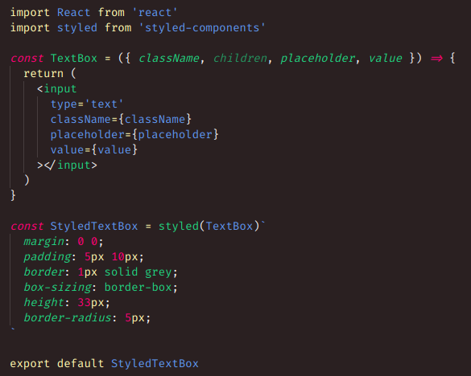

As in: I had forgotten that this hadn't been published when I wanted to use it on another computer.

F is a theme made for Markdown editing, by someone whose main use of VSCode is to write stories, novels and intentionally bad fanfiction. It's probably **not a great fit for code editing,** and got its start by editing the Monokai theme that comes with VSCode.

## Why F?

F is the first letter in forgotten, _and_ it's my favourite letter, _and_ it's also something different. It's certainly easy to find in the Theme Picker :).

Interested? Hit ctrl/cmd-p inside of VSCode and type `ext install k4y4k.f`.

Also, if you do end up using this theme (and you like it), you can come tell me about it [on Twitter!](https://twitter.com/by_k4y4k) It'd be awesome to hear suggestions and/or feedback from someone else. Pull requests welcome on the [Git repo,](https://github.com/by-k4y4k/F-vscode-theme) too!
