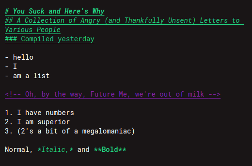

# F is for Forgotten

As in: I had forgotten that this hadn't been published when I wanted to use it on another computer.

F is a theme made for Markdown editing, by someone whose main use of VSCode is to write stories, novels and intentionally bad fanfiction. It's probably **not a great fit for code editing,** and got its start by editing the Monokai theme that comes with VSCode.

### TODO:
- [ ] debug status bar colour looks yuck
- [ ] admit to the world that I am actually 5 and yuck is an atomic-bomb level insult