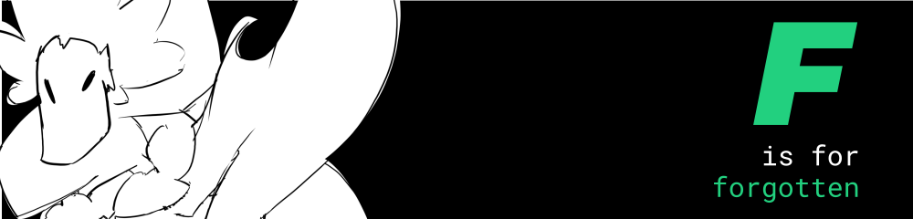
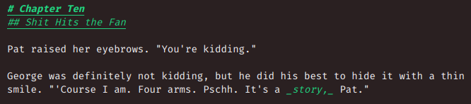
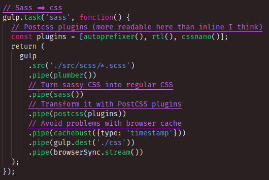

# F 0.2.32
## Codename: Sizzlin CSS

As in: I had forgotten that this hadn't been published when I wanted to use it on another computer.

This theme was originally made specifically for Markdown editing. Its main goal was to make headings, bolding and italicisation more visually distinct:

However, a problem arose when I began to use VSCode for things other than Markdown editing (that is, programming). Its syntax highlighting was identical to Monokai, which it was a shallow edit of.

## Introducing version 2!

**F 0.2.0** comes with new colours and scope rules! This is an example of F in use inside a Gulpfile:

This also changes the Git colours, so here's a handy little table so that you don't get lost.

| **Meaning** | **Colour** | **Human Name** |
| ----------- | ---------- | -------------- |
| Untracked   | #22d07f    | Green          |
| Modified    | #d9d4ac    | Off-white      |
| Deleted     | #cd61f8    | Purple         |

 

## Why F?

F is the first letter in forgotten, _and_ it's my favourite letter, _and_ it's also something different. It's certainly easy to find in the Theme Picker :).

Interested? Hit ctrl/cmd-p inside of VSCode and type `ext install k4y4k.f`.

### What's that thing in the icon and the banner?

She's a wyvern who is, as yet, nameless.

## What now?

Also, if you do end up using this theme (and you like it), you can come tell me about it [on Twitter!](https://twitter.com/by_k4y4k) It'd be awesome to hear suggestions and/or feedback from someone else. Pull requests welcome on the [Git repo,](https://github.com/by-k4y4k/F-vscode-theme) too!
